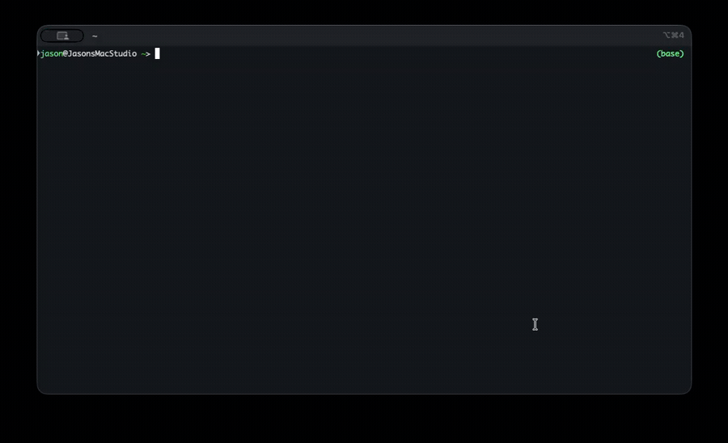

# homebrew-tap

Homebrew formulae for [j-norwood-young](https://github.com/j-norwood-young).

## clitorrents

**Search, download, and manage torrents from your terminal — then hand the keys to your AI.**

[clitorrents](https://github.com/j-norwood-young/clitorrents) is a fast, keyboard-driven TUI torrent client built on WebTorrent. Search across providers, watch live progress with sparklines and peer lists, route TV/movies/music into separate folders, and keep downloads running in a background daemon after you quit the UI.

It also ships as an **[MCP server](https://modelcontextprotocol.io)**. Wire it into Cursor, Claude Desktop, [Hermes](https://github.com/NousResearch/hermes), [OpenClaw](https://github.com/openclaw/openclaw), or any MCP-capable agent and say things like *"download the latest Ubuntu ISO"* or *"grab Sintel in 1080p"* — totally legal stuff, of course.

### Install

```bash
brew install j-norwood-young/tap/clitorrents
```

Then launch the TUI:

```bash
clitorrents
```

Or try it instantly without installing:

```bash
npx clitorrents
```

### TUI in action

<video src="docs/demo/tui.mp4" autoplay loop muted playsinline width="1100"></video>

Search from the top pane, browse paginated results on the left, and monitor active transfers (with sparklines) on the right. Press **Tab** to move between panes, **Enter** to search or add a torrent, **Ctrl+Q** to quit — downloads keep running in the background.

<details>
<summary>Animated GIF (fallback)</summary>



</details>

### CLI & daemon

```bash
clitorrents search "ubuntu 24.04" --limit 5   # print results
clitorrents download sintel --pick 1          # add & download via daemon
clitorrents status                            # daemon PID, uptime, transfers
clitorrents stop                              # stop daemon and all transfers
```

### MCP server — torrents for your agents

Add clitorrents as an MCP server and your AI assistant gets tools to search, add, pause, resume, and monitor torrents:

| Tool | What it does |
|------|----------------|
| `search` | Query torrent providers |
| `add_torrent` | Add by magnet, hash, URL, or search query |
| `list_transfers` / `transfer_status` | Monitor progress |
| `pause_torrent` / `resume_torrent` / `remove_torrent` | Control downloads |
| `get_config` / `set_config` / `set_limits` | Tune behaviour |

**Cursor / Claude Desktop** — add to your MCP config:

```json
{
  "mcpServers": {
    "clitorrents": {
      "command": "clitorrents",
      "args": ["mcp"]
    }
  }
}
```

After `brew install`, the binary is on your `PATH`. Without a global install, use `"command": "npx", "args": ["-y", "clitorrents", "mcp"]` instead.

Full setup, config reference, and keybindings: **[clitorrents README](https://github.com/j-norwood-young/clitorrents#readme)**.

> **Use responsibly.** Only download content you have the right to access.

## Formulae

| Formula | Description |
|---------|-------------|
| [clitorrents](Formula/clitorrents.rb) | Terminal torrent TUI + MCP server |

## Updating demo media

Record a screencast, then convert with ffmpeg:

```bash
./docs/demo/convert-capture.sh ../clitorrents/clitorrents-capture.mov
```
